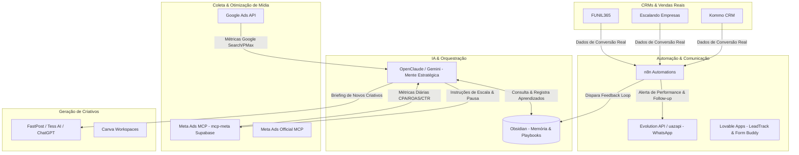

# 🛠️ Arquitetura de Dados e Integrações — Agente Autônomo Resolv

> Documento de arquitetura técnica que mapeia a integração entre a **Mente Estratégica (OpenClaude)**, os **Agentes Autônomos**, a **Memória Operacional (Obsidian)** e a **Stack de Ferramentas da Agência Resolv**.

---

## 📡 1. Mapeamento da Stack Operacional



---

## 🔌 2. Endpoints & Chaves de Integração Mapeadas

### A. Coleta & Otimização Meta Ads
* **Servidor MCP Supabase**: `https://llzeqjpueamnytmansdy.supabase.co/functions/v1/mcp-meta`
* **Servidor MCP Meta Oficial**: `https://mcp.facebook.com/ads`
* **Recursos Executáveis**:
  * `list_campaigns(client_id)`: Puxa gasto, leads, CPL, CTR e impressões.
  * `pause_object(id, type)`: Pausa anúncios ou conjuntos com CTR < 1% ou CPL > 2x o benchmark.
  * `update_budget(adset_id, budget)`: Aplica regra de escala diária (+15% a +20%).

### B. Motor de Automação & Notificação WhatsApp
* **Painel n8n**: `https://n8n.resolvsolucoes.com.br/home/workflows`
* **Evolution Manager (WhatsApp API)**: `https://api.resolvsolucoes.com.br/manager/`
* **uazapi**: `https://uazapi.dev/`
* **Fluxos Automatizados**:
  1. *Relatório Matinal Autônomo*: O n8n puxa os dados do Supabase/Meta Ads às 08h e envia resumo formatado no WhatsApp do gestor.
  2. *Alerta de CPA Crítico*: Se o CPA de uma conta subir mais de 35% no dia, dispara alerta imediato no WhatsApp.
  3. *Recuperação de Leads*: Notifica o comercial do cliente no WhatsApp assim que um formulário Meta Lead Ads é preenchido.

### C. Geração Autônoma de Criativos
* **FastPost**: `https://fastpost.escalandoempresas.com.br/`
* **Tess AI**: `https://tess.pareto.io/`
* **Canva API / Folders**: Mapeados por cliente para substituição de imagens/copies com alta saturação.

---

## 🔄 3. Ciclo de Aprendizado Contínuo (Feedback Loop)

```
[1. Coleta] ---> [2. Diagnóstico] ---> [3. Decisão] ---> [4. Execução] ---> [5. Registro]
 Meta/Google     CPA > Alvo?          Pausar Ad          MCP / OpenClaw       Atualizar nota
  Ads APIs       CTR < 1%?            Escalar +20%       no Meta Ads          em Clientes/
```

1. **Leitura**: O **Agente 1 (Diagnóstico)** lê as métricas de todas as contas ativas (`act_*`).
2. **Avaliação**: Se a Frequência do conjunto for > 3.5 e o CTR cair mais de 20%, o **Agente 2 (Criativos)** marca o anúncio como *Saturado*.
3. **Escala**: Se o ROAS for > 3.0 por 3 dias consecutivos, o **Agente 3 (Escala)** envia comando para o MCP aumentar o orçamento em 15%.
4. **Registro na Memória**: A decisão e o resultado do teste são gravados na pasta `Clientes/<Nome_do_Cliente>.md` no Obsidian.
