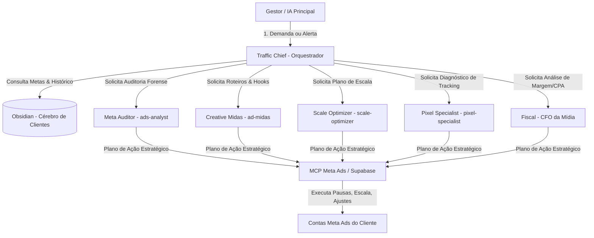

# 🛡️ Resolv Tráfego Squad — Sistema de Agentes de Tráfego Pago

> **Inspirado no Koko Tráfego Squad & Meta Ads AI Connectors (2026)**  
> **Filosofia:** *"Não seja um apertador de botão."* O MCP da Meta executa os comandos, mas o **Resolv Tráfego Squad** é o cérebro que analisa o contexto do negócio, a margem do cliente, a fadiga de criativos e o LTV antes de gastar R$ 1,00 de orçamento.

---

## 🏛️ Estrutura do Squad (6 Agentes Especializados)



---

## 🤖 Papel e Atribuições de Cada Agente

### 🎯 1. `traffic-chief` (Orquestrador Mestre)
- **Função**: Triagem e roteamento de problemas de tráfego.
- **Como atua**: Lê a nota do cliente no Obsidian (ex: `[[Clientes/Advocacia Tributaria - Dr Odirley/Advocacia Tributaria - Dr Odirley]]`), verifica a meta de CPL e delega a análise para os especialistas.

### 🔍 2. `meta-auditor` (Auditor Forense de Conta)
- **Função**: Auditoria de estrutura, gasto desperdiçado, sobreposição de públicos e fadiga de anúncios.
- **Ferramentas MCP Usadas**: `get_campaigns`, `get_insights`, `get_ad_accounts`.

### 🎨 3. `creative-midas` (Estrategista de Criativos & Hooks)
- **Função**: Leitura de retenção de vídeo, CTR e fadiga de anúncio.
- **Atuação**: Quando o CTR cai < 0.8% e a Frequência é > 3.0, gera novos briefings de hooks e manda para geração no FastPost/Canva/ChatGPT.

### 📈 4. `scale-optimizer` (Engenheiro de Escala)
- **Função**: Escala vertical (+15% a +20%) e escala horizontal (duplicação de conjuntos para novos públicos).
- **Ferramentas MCP Usadas**: `update_ad_set`, `create_campaign`.

### ⚡ 5. `pixel-specialist` (Infraestrutura & Tracking)
- **Função**: Diagnóstico de pixel, Conversions API (CAPI), UTMs e Match Quality de eventos.
- **Ferramentas MCP Usadas**: `get_pixel_events`, `validate_event_match_quality`.

### 💰 6. `fiscal-cfo` (CFO da Mídia do Cliente)
- **Função**: Cruza CPL/CPA da plataforma com a margem financeira real e LTV do cliente.
- **Atuação**: Garante que uma campanha com CPL baixo não esteja trazendo leads sem potencial de fechar contrato.

---

## 🛠️ Como Usar no Dia a Dia

Para auditar e otimizar qualquer cliente da carteira:

```text
@traffic-chief #cliente "Dr. Odirley" *diagnose
```
1. O **Traffic Chief** lê os parâmetros em `Clientes/Advocacia Tributaria - Dr Odirley/Advocacia Tributaria - Dr Odirley.md`.
2. O **Meta Auditor** consulta os dados ao vivo via `mcp-meta` ou `mcp.facebook.com/ads`.
3. O **Creative Midas** valida se os criativos estão fatigados.
4. O plano de ação é aprovado pelo gestor e executado pelo MCP na conta Meta Ads!
